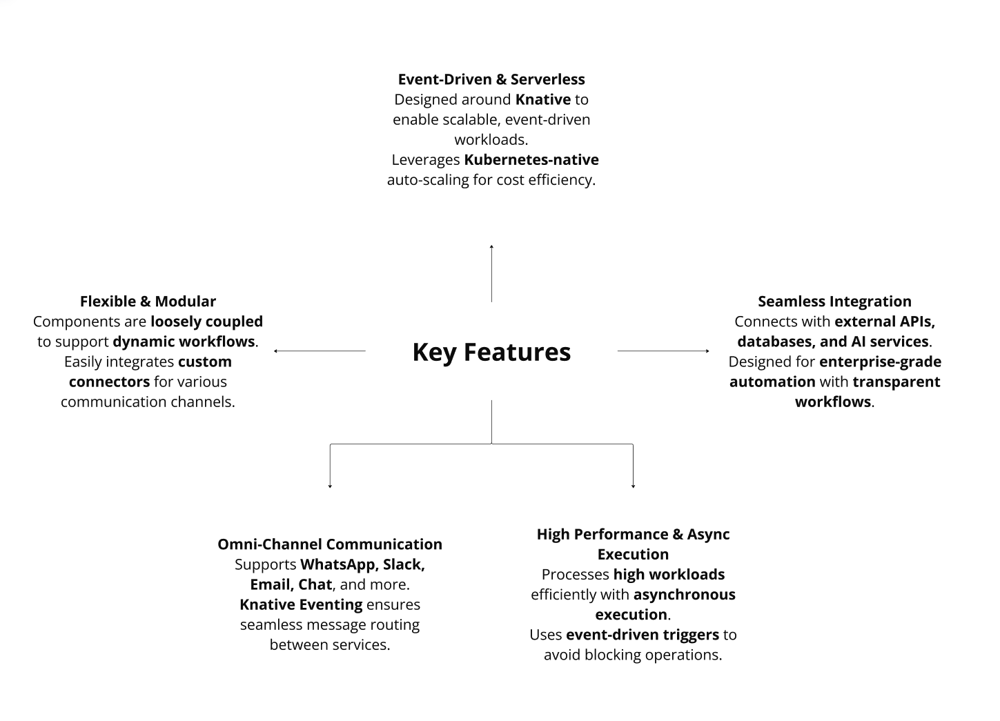

  

# Table of Contents

- [Welcome to Alquimia AI](#welcome-to-alquimia-ai)
- [Technical Overview](#technical-overview)
- [Key Features](#key-features)
  - [Event-Driven & Serverless](#event-driven--serverless)
  - [Flexible & Modular](#flexible--modular)
  - [Context-Aware Prompting](#context-aware-prompting)
  - [Omni-Channel Communication](#omni-channel-communication)
  - [Intelligent Memory Management](#intelligent-memory-management)
  - [High Performance & Async Execution](#high-performance--async-execution)
  - [Multi-Agent & Multi-LLM](#multi-agent--multi-llm)
  - [Enterprise-Grade Automation](#enterprise-grade-automation)
- [Architecture](#architecture)
- [Source Code and Distribution](#source-code-and-distribution)
  - [Alquimia Runtime](#alquimia-runtime)
  - [Alquimia SDK UI](#alquimia-sdk-ui)

# Welcome to Alquimia AI

Alquimia is an advanced Agentic AI platform designed to deploy and manage AI agents and assistants in collaborative and enterprise environments. It provides a robust framework for creating, running, and scaling AI-driven conversational agents that replicate human-like interactions based on seven core principles:

- Identity and Personality Consistency: Agents maintain a clear, consistent identity with a defined tone, character, and values throughout interactions.
- Empathy and Emotional Response: Agents interpret user emotions and respond empathetically, ensuring users feel understood and supported.
- Contextualization and Conversational Memory: Agents leverage conversation history and contextual elements to deliver relevant, coherent responses.
- Fluency and Natural Dialogue: Agents generate fluid, natural conversations with coherent narrative flow and smooth transitions between topics.
- Honesty and Recognition of Limits: Agents admit when they lack information and offer alternatives or a willingness to investigate further.
- Adaptability and Flexibility: Agents adjust their communication style, detail level, and focus based on user needs and context.
- Ethics and Social Responsibility: Agents adhere to pro-social, respectful, inclusive, and transparent behaviors, ensuring trust and integrity.

# Technical overview

Alquimia is powered by the Alquimia Operational Handler, an event-driven runtime built for managing multi-agent LLM (Large Language Model) solutions in containerized environments. Key features include:

- Event-Driven Architecture: Agents are activated based on confidence thresholds for specific tasks, ensuring efficient resource utilization.
- Scale-to-Zero: The platform guarantees controlled performance and costs by scaling resources dynamically.
- Hybrid Deployment: Supports on-premise, cloud, and hybrid cloud environments, offering flexibility and security for enterprise clients.
- Built on Knative: Enables seamless orchestration of LLMs, intelligent memory management, context-aware prompting, and complex tool execution.
- Kubernetes and OpenShift Compatibility: Lightweight, highly scalable, and natively integrated with modern AI ecosystems like OpenShift AI and LangChain.
- Multi-LLM and RAG Support: Compatible with diverse LLM providers, vector stores, and Retrieval-Augmented Generation (RAG) strategies, making it ideal for building enterprise-grade AI applications.

Alquimia is tailored for medium to large enterprises, offering a secure, scalable, and cost-effective solution for deploying AI agents in mission-critical environments. Its modular architecture and focus on ethical AI make it a trusted choice for developers and architects building next-generation AI-powered applications.

# Key features

  

## Event-Driven & Serverless

- Built on Knative: The runtime is designed around Knative, enabling scalable, event-driven workloads. This allows the platform to handle tasks efficiently by triggering actions based on specific events.
- Kubernetes-Native Auto-Scaling: Leverages Kubernetes' native auto-scaling capabilities to ensure cost efficiency by dynamically adjusting resources based on workload demands.

## Flexible & Modular

- Loosely Coupled Components: The architecture is modular, with components that are loosely coupled, allowing for flexibility and ease of integration with external systems.
- Integration with External APIs, Databases, and AI Services: The platform can connect with various external APIs, databases, and AI services, enabling dynamic workflows.
- Custom Connectors: Supports the integration of custom connectors for different communication channels and workflows, making it adaptable to diverse enterprise needs.

## Context-Aware Prompting

- Context-Aware Prompting: The platform uses context-aware prompting to ensure that the LLM is always aware of the latest information and can use it to generate more accurate and relevant responses.
- Conversation History: The platform uses conversation history to ensure that the LLM is always aware of the latest information and can use it to generate more accurate and relevant responses.
- Context-Aware Prompting: The platform uses context-aware prompting to ensure that the LLM is always aware of the latest information and can use it to generate more accurate and relevant responses.

## Omni-Channel Communication

- Multi-Channel Support: The runtime supports communication across multiple channels, including WhatsApp, Slack, Email, Chat, and more. This ensures seamless interaction with users across various platforms.
- Custom Connectors: Supports the integration of custom connectors for different communication channels and workflows, making it adaptable to diverse enterprise needs.

## Intelligent Memory Management

- Intelligent Memory Management: The platform uses intelligent memory management to ensure that the LLM is always aware of the latest information and can use it to generate more accurate and relevant responses.
- Conversation History: The platform uses conversation history to ensure that the LLM is always aware of the latest information and can use it to generate more accurate and relevant responses.

## High Performance & Async Execution

- Efficient Workload Processing: The platform is designed to handle high workloads efficiently, using asynchronous execution to avoid blocking operations and ensure smooth performance.
- Knative Eventing: Utilizes Knative Eventing for seamless message routing between services, ensuring that events are processed and routed efficiently.

## Multi-Agent & Multi-LLM

- Multi-Agent: The platform supports the use of multiple agents, allowing for complex, multi-step conversations and tasks.
- Multi-LLM: The platform supports the use of multiple LLMs, allowing for different LLMs to be used for different tasks and conversations.

## Enterprise-Grade Automation

- Transparent Workflows: Designed for enterprise-grade automation, the platform offers transparent workflows, making it easier to manage and monitor complex processes.
- Event-Driven Triggers: Uses event-driven triggers to initiate actions, ensuring that operations are executed only when necessary, which enhances efficiency and reduces resource wastage.

Alquimia runtime is a highly scalable, flexible, and efficient platform designed for enterprise environments. Its event-driven, serverless architecture built on Knative and Kubernetes ensures cost efficiency and high performance, while its support for omni-channel communication and custom integrations makes it a versatile solution for modern AI-driven workflows.

# Architecture

Alquimia is a cutting-edge Agentic AI platform designed to empower developers and enterprises to build, deploy, and manage AI agents and assistants in collaborative and enterprise environments. At its core, Alquimia is built on a reactive, serverless architecture that combines scalability, flexibility, and cost efficiency to deliver human-like conversational experiences. The architecture is designed to handle complex workflows, multi-channel communication, and dynamic user interactions while maintaining high performance and ethical standards.

For more information about the architecture, please refer to the [Architecture](architecture/README.md) documentation.

# Source Code and distribution

Alquimia provides two main open-source distributions to help developers build and deploy AI-driven agents and assistants. Below is an explanation of each distribution and its documentation focus:

## Alquimia Runtime

The Alquimia Runtime is the core engine that powers the deployment and management of AI agents in enterprise environments. It is designed to be event-driven, serverless, and highly scalable, built on Knative and Kubernetes.

For further information about the Alquimia Runtime, please refer to the [Alquimia Runtime README](runtime/README.md).

## Alquimia SDK UI

The Alquimia SDK UI is a React library designed to help developers seamlessly implement user interfaces for AI agents. It supports Next.js 14 and above, making it easy to integrate agent UIs into modern web applications.

For further information about the Alquimia SDK UI, please refer to the [Alquimia SDK UI README](ui-sdk/README.md).
