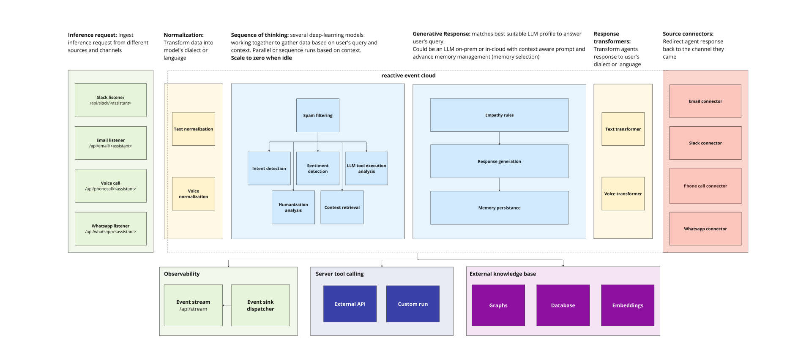

# Reactive Serverless

The Alquimia runtime is a reactive serverless platform that is built on Knative and Kubernetes. It is designed to be a scalable, flexible, and efficient platform for building AI-driven workflows.

## Table of Contents

- [Inference Request](#inference-request)
- [Normalization](#normalization)
- [Sequence of Thinking](#sequence-of-thinking)
- [Generative Response](#generative-response)
- [Response Transformers](#response-transformers)
- [Source Connectors](#source-connectors)
- [Observability](#observability)
- [Server Tool Calling](#server-tool-calling)
- [External Knowledge Base](#external-knowledge-base)
- [Output](#output)
- [Benefits](#benefits)

This Reactive Serverless Architecture is designed for enterprise-grade automation, offering scalability, flexibility, and cost efficiency. Its ability to process requests, generate context-aware responses, and deliver them across multiple channels makes it a powerful solution for modern AI-driven applications. The focus on observability and extensibility ensures that the system remains transparent, adaptable, and future-proof.

## Inference Request

- **What it is:** This is the entry point of the system where user queries or requests are captured from various sources and channels.
- **Key components:**
  - **Main Internet:** Requests from general web applications or interactive platforms.
  - **Local Internet:** Requests from localized or internal networks.
  - **Email:** Requests from email clients.
  - **Voice Calls:** Requests from voice call systems.
  - **WhatsApp:** Requests from WhatsApp.
  - **Slack:** Requests from Slack.
- **Purpose:** To collect and categorize user queries from multiple communication channels (e.g., chat, email, video calls) and prepare them for processing.
- **How it works:** The system identifies the source of the request and formats it into a standardized structure for further analysis.

## Normalization

- **What it is:** The process of transforming raw data (user queries) into a format that the system's models can understand and process.
- **Purpose:** To ensure that the data is clean, contextualized, and ready for the next stages of processing.
- **How it works:** The system uses advanced AI models to preprocess the query, extract key information, and enrich it with context.

## Sequence of Thinking

- **What it is:** A collaborative process where multiple deep-learning models work together to analyze the query and generate a response.
- **Key Components:**
  - **Parallel or Sequential Execution:** Models can run in parallel (for speed) or sequentially (for dependency-based tasks) depending on the context. Multiple deep-learning models work together (in parallel or sequence) to analyze the query and gather relevant data.
  - **Context-Aware Processing:** The system uses the query and its context to determine the best approach for generating a response.
- **Purpose:** To ensure that the system's response is accurate, relevant, and contextually appropriate.
- **How it works:** The models analyze the query, retrieve relevant data, and prepare it for the generative response stage.

## Generative Response

- **What it is:** The stage where the system generates a response to the user's query using a Language Model (LAM).
- **Key Components:**
  - **LAM Profile Selection:** The system selects the most suitable language model (on-person or in-cloud) based on the query and context.
  - **Context:** The response is generated using prompts that are aware of the query's context.
  - **Adjacent Memory Management::** The system uses memory to ensure the response is coherent and consistent with previous interactions.
- **Purpose:** To provide a human-like, contextually relevant response to the user's query.
- **How it works:** The selected LAM generates a response based on the query, context, and memory of past interactions.

## Response Transformers

- **What it is:** The process of transforming the system's response into a format that matches the user's dialect, language, or preferred style.
- **Key Components:**
  - **Templify Rules:** Standardizes the response format for consistency.
  - **Response Generation:** Creates the final output in the desired format.
  - **Memory Persistence:** Stores relevant data for future interactions.
- **Purpose:** To ensure the response is personalized, user-friendly, and consistent with the user's expectations.
- **How it works:** The system adapts the response to match the user's language, tone, and communication style.

## Source Connectors

- **What it is:** The stage where the system delivers the response back to the original channel (e.g., chat, email, video call).
- **Key Components:**
  - **Text Transformers:** Adapt the response for different communication channels (e.g., WhatsApp, Slack, Email).
- **Purpose:** To ensure the response is delivered seamlessly across multiple platforms.
- **How it works:** The system routes the response to the appropriate channel and formats it for delivery.

## Observability

- **What it is:** The process of monitoring and logging the system's performance and behavior.
- **Key Components:**
  - **Metrics:** Tracks the system's performance and behavior.
  - **Logs:** Logs the system's performance and behavior.
  - **Traces:** Traces the system's performance and behavior.

## Server Tool Calling

- **What it is:** The system's ability to integrate with external APIs and tools for additional functionality.
- **Key Components:**
  - **External API:** Connects to third-party services for enhanced capabilities.
  - **Custom Run:** Executes custom scripts or processes as needed.
- **Purpose:** To extend the system's functionality by leveraging external resources.
- **How it works:** The system calls external APIs or runs custom scripts to perform specific tasks.

## External Knowledge Base

- **What it is:** A repository of external data that the system can access to enhance its responses.
- **Key Components:**
  - **Graphs:** Structured data for relationships and connections.
  - **Databases:** Stores and retrieves information.
  - **Embeddings:** Semantic representations of data for better understanding.
- **Purpose:** To provide the system with additional knowledge and context for generating accurate responses.
- **How it works:** The system queries the knowledge base to retrieve relevant information for the response.

## Output

- **What it is:** The final output of the system, which is the response to the user's query.
- **Purpose:** To provide a response that is accurate, relevant, and context-aware.
- **How it works:** The system formats the response into a standardized structure for further processing and delivery.

# Benefits

- **Scalability:** The serverless architecture ensures the system can handle high workloads efficiently.
- **Flexibility:** Modular components allow for easy integration with external tools and services.
- **Cost Efficiency:** Scale-to-zero and dynamic resource allocation minimize costs.
- **Personalization:** Context-aware processing and response transformers ensure user-friendly interactions.
- **Observability:** Real-time monitoring provides transparency and enables quick troubleshooting.
- **Extensibility:** Integration with external APIs and knowledge bases enhances the system's capabilities.
