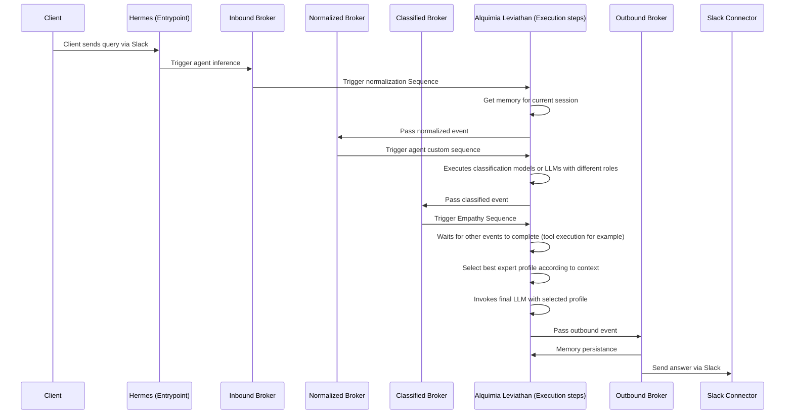

# Alquimia Operational Handler

<p align="center">
  <a href="#community">Community</a> |
  <a href="#key-features">Key features</a> |
  <a href="#use-cases">Use cases</a> |
  <a href="#getting-started">Getting started</a> |
  <a href="#workflow">Workflow</a> |
  <a href="#examples">Examples</a> |
  <a href="#contributing">Contributing</a> |
  <a href="https://www.alquimia.ai/">Alquimia AI</a>
</p>
<p align="center">
  
</p>

## Community

We are building **enterprise-ready AI agents** with a focus on **transparency, consistency, and flexibility**. Contributions from the community help ensure reliability and innovation.

### Get Involved

- **GitHub Discussions** – [Join here](/discussions)
- **Slack** – [Community chat](https://slack.com/alquimiaai)

Your contributions help improve AI automation for everyone.

## Introduction

**Alquimia Operational Handler** is an advanced, event-driven platform designed to manage multi-agent **LLM (Large Language Model)** solutions in **containerized environments**. Built on **Knative**, it provides seamless orchestration of LLMs, intelligent memory management, context-aware prompting, and complex tool execution.

Designed for **Openshift** and **Kubernetes**, the platform offers **lightweight deployment, high scalability, and native integrations** with modern AI ecosystems, including **Openshift AI** and **LangChain**. It supports a diverse range of **LLM providers**, **vector stores**, and **retrieval-augmented generation (RAG) strategies**, making it an ideal solution for enterprises and developers building AI-powered applications.

---

## Key Features

### 🧬 **Event-Driven & Serverless**

- Built on **Knative** for automatic scaling and serverless execution.
- Fully **asynchronous** to ensure optimal performance and responsiveness.

### :cloud: **Seamless Cloud-Native Integration**

- Works **natively** on **Openshift** and **Kubernetes**.
- Supports **Openshift AI** for direct access to deployed models.
- **LangChain-compatible**, enabling powerful agent-driven workflows.

### 🦜 **Flexible Multi-LLM Support**

- Works with major LLM providers, including:
  - **OpenAI**
  - **Mistral**
  - **DeepSeek**
  - **LLama**

### :book: **Advanced RAG & Vector Store Integration**

- Supports **retrieval-augmented generation (RAG)** for enhanced AI reasoning.
- Compatible with vector stores like:
  - **Qdrant**
  - **Chroma**
  - **ElasticSearch**

### :envelope_with_arrow: **Omnichannel AI Integration**

- Use **custom connectors** or **community Kamelets (Camel K)** for seamless omnichannel support.
- Automate AI-powered workflows across multiple communication channels.

### 🥷 **Versatile Tool Execution**

- Supports **server-side**, **client-side**, and **hybrid** tool execution.
- Context-aware execution strategies to optimize performance.

### :rocket: **Lightweight & Production-Ready**

- Minimal boilerplate, enabling rapid development and deployment.
- Enterprise-ready with **scalability, reliability, and observability**.

---

## Why Choose Alquimia Operational Handler?

✅ **Scalability** – Effortlessly scale AI workflows with Knative.  
✅ **Flexibility** – Works with multiple LLM providers, vector stores, and orchestration frameworks.  
✅ **Performance** – Asynchronous, event-driven execution optimizes efficiency.  
✅ **Integration** – Native compatibility with **LangChain**, **Openshift AI**, and containerized environments.  
✅ **Serverless Superpowers** – Automatically scale workloads, reducing operational costs.

---

## Use Cases

1.  **Multi-Agent AI Orchestration** – Manage and coordinate complex LLM-driven workflows.
2.  **Enterprise-Scale Document Retrieval** – Implement **RAG** for intelligent search and knowledge retrieval.
3.  **Omnichannel AI Automation** – Deploy AI-powered solutions across multiple communication channels.
4.  **Hybrid Tool Execution** – Dynamically execute AI tools across client, server, or hybrid environments.

---

## Getting Started

### **Prerequisites**

- A running **Openshift** or **Kubernetes** cluster.
- **Openshift Serverless (Knative)** runtime installed.
- **Openshift Service Mesh (Istio)** for networking.
- **AMQ Streams (Strimzi)** for event-driven messaging.
- A Redis instance for memory and cache management
- A Couchdb instance to manage agent configurations
- Optional: **Vector store** (e.g., Qdrant, Chroma, or ElasticSearch) for RAG capabilities.

### **Installation**

#### Install on Openshift

Ensure you have:

- **OC client** installed.
- **Knative support for Kafka** via **Strimzi (AMQ Streams)**.

Then, deploy the platform:

```bash
oc apply -f serving/base.yaml
oc apply -f eventing/base.yaml
```

Now you are ready to deploy your first agent

## Workflow

The proposed architecture is intented to be a common framework for agents. You can change it to adapt your needs. Recommend set up:



## Examples

See our list of full working examples [here](/examples)

## Integrations

You can find our custom channel integrations [here](integrations/) or deploy [community Kamelets](https://camel.apache.org/camel-kamelets/4.8.x/)

## Server tools

Find all server tools available [here](tools/) and see how easy is to create your own bundle.

## Local development

For more information on how to set your local develop environment see docs [here]('docs/local-development.md')

## CLI Usage

Alquimia Operational Handler provides a **CLI** for managing embeddings, updating assistants configuration, and invoking AI-powered functions in your cluster.

### **Available CLI Operations**

Install required libs (use of virtual environments recommended):

```bash
pip install -r requirements.txt
```

Then list of available operations by running:

```bash
python main.py --help
```

For more detail see:

1.  **Invoke AI Functions** – [Functions invocation](apps/)
2.  **Manage Embeddings** – [Embeddings operations](embeddings/)
3.  **Configure Assistants** – [Configuration](config/)

---

## Contributing

We are building **an open, collaborative community**. Contributions are always welcome!

If you'd like to add features, improve documentation, or suggest enhancements:

1.  Fork the repository.
2.  Create a new branch (`git checkout -b feature-xyz`).
3.  Submit a **pull request** with your proposed changes.

---

## License

**Alquimia Operational Handler** is open-source and available under the **MIT License**.

---
